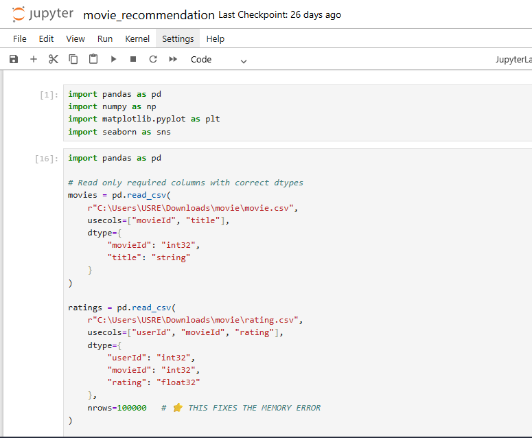
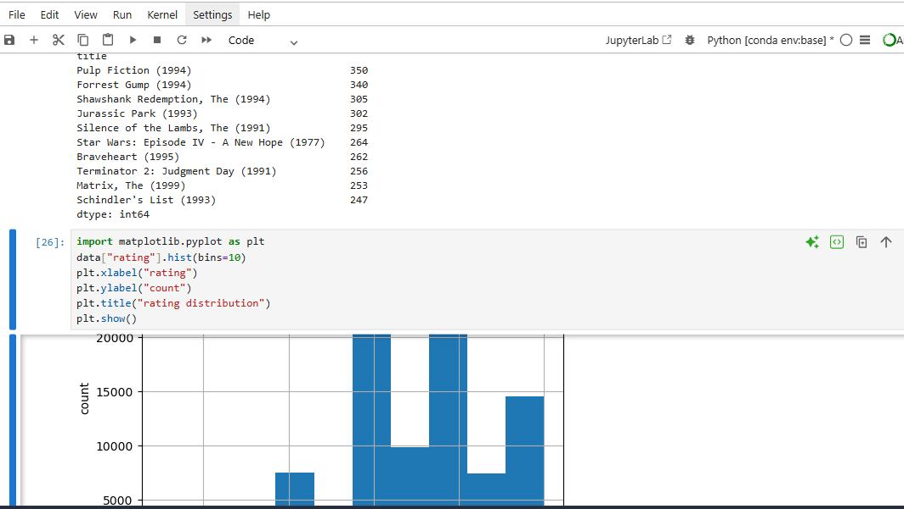
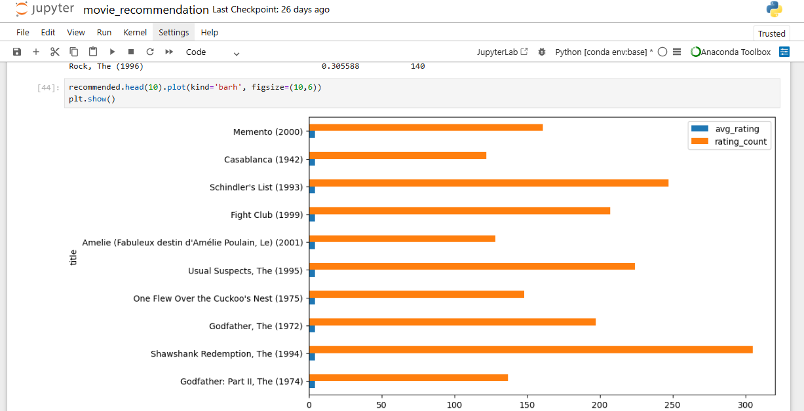
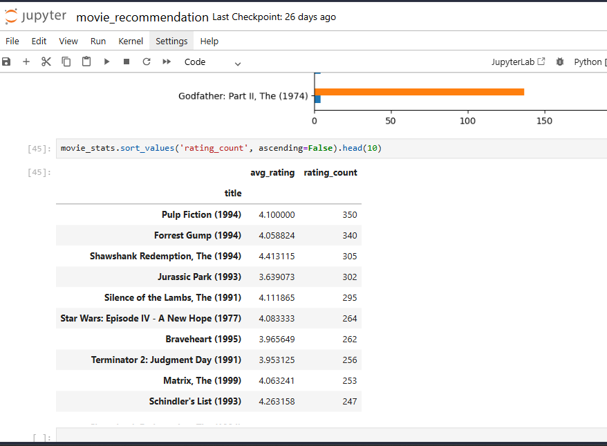

# Movie Recommendation System Analysis

## Overview
This project recommends movies based on user ratings and analyzes trends.

## Tools Used
- Python
- Pandas
- Scikit-learn
- Jupyter Notebook

## Output

